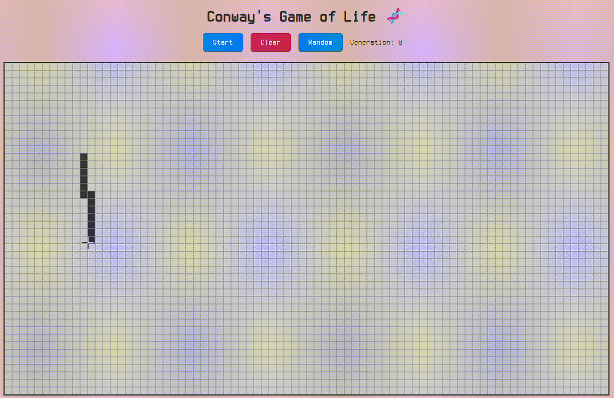

# Conway's Game of Life 🧬

A dynamic and interactive browser-based simulation of John Conway's famous cellular automaton, the Game of Life. This project is built with plain HTML, CSS, and JavaScript, focusing on a clean interface and intuitive user controls.



---
## 🚀 Live Demo

[**You can check out the live version here!**](https://kyuuaditya.github.io/game-of-life/)

---
## ✨ Features

* **Interactive Grid:** Draw and design your own initial patterns directly on the canvas before starting the simulation.
* **Intuitive Mouse Controls:** Use **left-click** to bring cells to life and **right-click** to erase them.
* **Full Simulation Control:** Easily **Start**, **Stop**, and **Clear** the simulation at any time.
* **Random Patterns:** Instantly populate the grid with a random configuration to discover new emergent patterns.
* **Real-time Generation Counter:** Keep track of how many generations the simulation has progressed through.
* **Informative UI:** The clean layout includes on-screen instructions and a link to the official Wikipedia page to learn more.
* **Custom Styling:** Styled with a unique custom font and a modern, dark-themed footer.

---
## 🛠️ How to Run Locally

No complex setup or dependencies are required! Just follow these simple steps:

1.  **Clone the repository:**
    ```bash
    git clone https://kyuuaditya.github.io/game-of-life.git
    ```
2.  **Navigate to the project directory:**
    ```bash
    cd game-of-life
    ```
3.  **Open the file:**
    Simply open the `index.html` file in your web browser.

---
## 💻 Tech Stack

This project is intentionally kept simple and accessible, using only core web technologies:

* **HTML5:** For the semantic structure of the page.
* **CSS3:** For all styling, including Flexbox for layout, `@font-face` for custom fonts, and a responsive design.
* **JavaScript (ES6+):** For the entire simulation logic, DOM manipulation, and handling all user interactions.

---
## 📁 File Structure

The project is organized into a few key files:

```
.
├── 📄 index.html      # The main HTML file containing the page structure and content.
├── 🎨 style.css       # All custom styles for layout, colors, and fonts.
└── ⚙️ script.js       # The core JS logic for the game, drawing, and controls.
